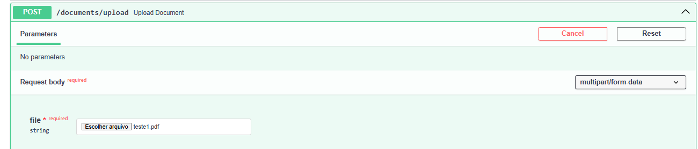
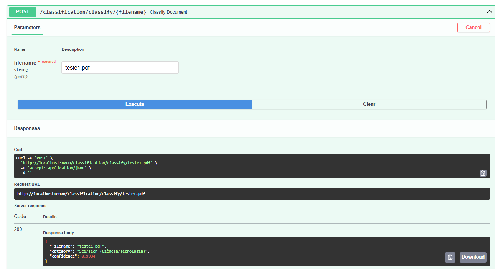
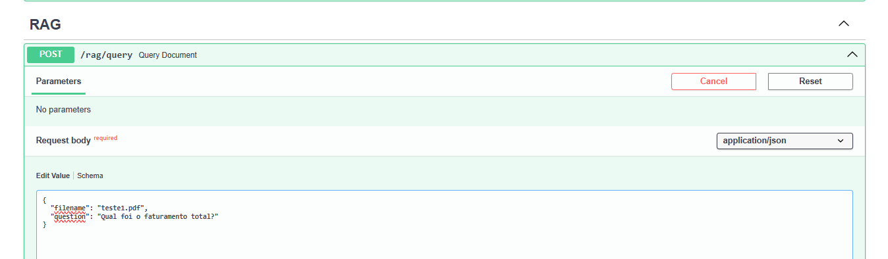
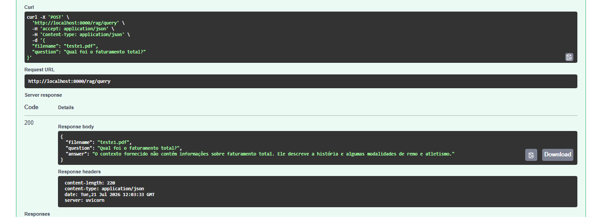

#  Smart Document AI

 **Uma plataforma completa para classificação de documentos, extração de texto, busca vetorial (RAG) e inferência com modelos Transformers (BERT) e estatísticos, com armazenamento persistente em MinIO via Docker.**

---

##  Visão Geral do Projeto

O **Smart Document AI** é uma solução *end-to-end* de Engenharia de Inteligência Artificial e Backend desenvolvida para automatizar o ciclo de vida completo de análise e recuperação de documentos não estruturados. 

A plataforma aborda desde o pré-processamento de documentos, treinamento e ajuste de modelos de PNL (Hugging Face / BERT) até a indexação vetorial (FAISS), busca semântica (*Retrieval-Augmented Generation*) e disponibilização de rotas de API REST escaláveis integradas ao MinIO Object Storage.

---

##  Arquitetura e Estrutura do Repositório

A estrutura foi projetada seguindo os princípios de modularidade, separação de responsabilidades (*Clean Architecture*) e reprodutibilidade:

```text
SMART-DOCUMENT-AI/
├── artifacts/             # Checkpoints de modelos, pesos exportados e métricas
├── data/                  # Conjuntos de dados brutos, processados e vetores FAISS
├── experiments/           # Logs de treinamento e experimentos de ML
├── outputs/               # Resultados de inferências e relatórios gerados
├── src/
│   ├── api/               # Endpoints FastAPI, rotas HTTP e schemas Pydantic
│   ├── datasets/          # Scripts de carregamento, parsing e validação de dados
│   ├── inference/         # Pipelines de predição e inferência em tempo real
│   ├── models/            # Definições das arquiteturas de ML/DL (BERT, etc.)
│   ├── preprocessing/     # Limpeza de texto, tokenização e extração de features
│   ├── rag/               # Mecanismo de busca semântica, FAISS e embeddings
│   ├── training/          # Scripts de treinamento, fine-tuning e avaliação
│   └── utils/             # Funções utilitárias, logger e gerenciamento de arquivos
├── .env                   # Variáveis de ambiente (não versionado)
├── .gitignore             # Regras de exclusão do Git para segurança
├── docker-compose.yml     # Orquestração da infraestrutura (Object Storage MinIO)
├── Dockerfile             # Imagem containerizada base para deploy/produção
├── README.md              # Documentação principal do projeto
└── requirements.txt       # Dependências e bibliotecas do projeto
```

##  Tecnologias e Ferramentas
Linguagem: Python 3.12
Framework Web & API: FastAPI, Uvicorn, Pydantic
Modelagem & Processamento NLP: Hugging Face Transformers, BERT, PyTorch, Scikit-learn
Busca Vetorial & RAG: FAISS (Facebook AI Similarity Search)
Armazenamento de Objetos: MinIO (Containerizado - S3 Compatible)
Containerização: Docker, Docker Compose

##  Como Executar o Projeto
A infraestrutura de armazenamento roda via Docker (MinIO) enquanto a API FastAPI é executada no seu ambiente virtual Python.
Pré-requisitos Python 3.12+ e ambiente virtual ativado (.venv).
Docker rodando na máquina.
### Passos:
*   Clonar o Repositório:

```
git clone [https://github.com/seu-usuario/smart-document-ai.git](https://github.com/seu-usuario/smart-document-ai.git)

cd smart-document-ai
```

*   Instalar Dependências:
```
pip install -r requirements.txt
```

*   Subir a Infraestrutura (MinIO):
```
docker compose up -d
```

Iniciar a API (FastAPI):
```
uvicorn src.api.main:app --reload --port 8000
```

Acessar os Serviços:
```
Documentação da API (Swagger UI): http://localhost:8000/docs
Painel de Controle MinIO: http://localhost:9001
```
---

## Principais Módulos do Sistema
1. Pré-processamento & Datasets (src/preprocessing, src/datasets)
Módulos responsáveis pelo carregamento de documentos PDF/Texto, tokenização, remoção de ruídos e estruturação do pipeline de entrada para os modelos de IA.

1. Treinamento & Modelos (src/models, src/training)
Contém a definição das arquiteturas baseadas em Transformers (Hugging Face BERT) e os scripts de ajuste fino (fine-tuning) e validação de métricas de classificação.

1. Mecanismo RAG & Busca Vetorial (src/rag)
Transforma os textos processados em vetores densos (embeddings) e realiza a indexação vetorial utilizando FAISS para consultas por similaridade de cosseno com baixíssima latência.

1. Inferência & API REST (src/inference, src/api)
Camada de serviços que expõe endpoints RESTful para envio de novos documentos, execução de inferências e consultas semânticas integradas ao MinIO e ao FAISS.

---
## Engenharia & Boas Práticas
Segurança de Credenciais: Isolamento completo de chaves e variáveis sensíveis através de .env e .gitignore estrito.

Armazenamento Isolado: MinIO containerizado garantindo persistência de volumes e simulação de ambiente de nuvem S3 local.

Modularidade: Código limpo e desacoplado separando a lógica de IA, ingestão de dados, API e infraestrutura.

### Endpoints


* Upload do arquivo


* Classificação do pdf


* RAG


